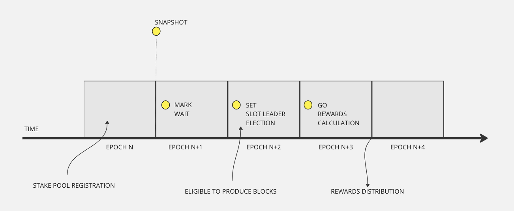

# Stake snapshots

At every epoch transition the system performs a stake distribution snapshot consisting of:

* _Stake: a mapping of credentials to lovelace._&#x20;
* _Delegations_: a mapping of credentials to stake pools
* _Pool Parameters_, storing the pool parameters of each stake pool

At any given time we must store the last three snapshots. To keep track of these three snapshots we use the names Mark, Set, Go. Where  **Mark** is the most recent one,  after an epoch it becomes **Set** and after another epoch it becomes **Go**.  &#x20;

&#x20;A snapshot **Mark** at Epoch transition E/E+1 will be used during Epoch N+2 (when it has become **Set**) for the slot leader election process and for rewards calculation during Epoch N+3 (when it becomes **Go)** &#x20;

<figure><figcaption></figcaption></figure>

On any current epoch, **Mark** is not actively used, **Set** is used for the slot leader election process, and **Go** is used for the rewards calculation.

<figure><figcaption></figcaption></figure>


For additional details, please see See section 11.1 of the [Shelley Ledger Specification](https://github.com/input-output-hk/cardano-ledger/releases/latest/download/shelley-ledger.pdf)

<figure><figcaption></figcaption></figure>

You can query the stake snapshots:


```
cardano-cli query stake-snapshot --testnet-magic 2 --stake-pool-id <POOL_ID>
```


```
{
    "activeStakeGo": 145769691498797,
    "activeStakeMark": 147258956481483,
    "activeStakeSet": 146034637994668,
    "poolStakeGo": 9497641630,
    "poolStakeMark": 9497641630,
    "poolStakeSet": 9497641630
}
```
