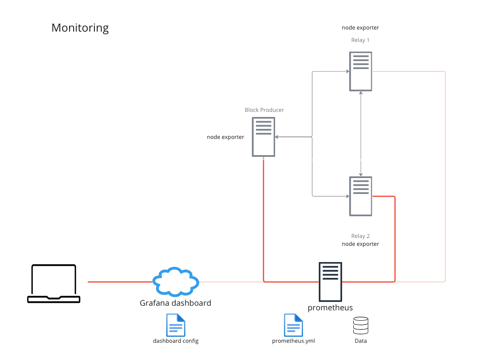

# Module 6 Monitoring our nodes

Cardano-node offers very important metrics about itself and the network. Makes them available for Prometheus and EKG. Let's set up a nice dashboard monitor our nodes.&#x20;

## Prometheus and node exporter

A reasonable monitoring setup looks like this:

<figure><figcaption></figcaption></figure>

First, lets configure our nodes to export metrics to prometheus, in the configuration file:

```
{
...
  "TurnOnLogMetrics": true,
...
 "hasPrometheus": [
  "0.0.0.0",
  12798
  ],
...
}
```

Now, lets install node-exporter in our relays and block producer nodes.&#x20;

* [https://prometheus.io/docs/guides/node-exporter/#monitoring-linux-host-metrics-with-the-node-exporter](https://prometheus.io/docs/guides/node-exporter/#monitoring-linux-host-metrics-with-the-node-exporter)
* Update firewall rules to allow connections to port 9100


Install prometheus on our monitoring server

* [https://prometheus.io/download/](https://prometheus.io/download/)
* Configure prometheus

```
# my global config
global:
  scrape_interval: 15s # Set the scrape interval to every 15 seconds. Default is every 1 minute.
  evaluation_interval: 15s # Evaluate rules every 15 seconds. The default is every 1 minute.
  # scrape_timeout is set to the global default (10s).

# Alertmanager configuration
alerting:
  alertmanagers:
    - static_configs:
        - targets:
          # - alertmanager:9093

# Load rules once and periodically evaluate them according to the global 'evaluation_interval'.
rule_files:
  # - "first_rules.yml"
  # - "second_rules.yml"

# A scrape configuration containing exactly one endpoint to scrape:
# Here it's Prometheus itself.
scrape_configs:
   - job_name: 'cardano' # To scrape data from the cardano node
     scrape_interval: 1s
     static_configs:
       - targets: ['127.0.0.1:12798']
   - job_name: 'node' # To scrape data from a node exporter to monitor your linux host metrics.
     scrape_interval: 1s
     static_configs:
       - targets: ['127.0.0.1:9100']
```

* Run Prometheus

```
./prometheus --config.file=prometheus.yml
```

## Set up a Grafana dashboard

We have 2 options:

*   Install and run grafana locally (i.e. in our monitoring server)&#x20;

    [https://grafana.com/get/?plcmt=top-nav\&cta=downloads\&tab=self-managed](https://grafana.com/get/?plcmt=top-nav\&cta=downloads\&tab=self-managed)
* Use the cloud version [https://grafana.com/get/?plcmt=top-nav\&cta=downloads](https://grafana.com/get/?plcmt=top-nav\&cta=downloads)

In either case:&#x20;

* Configure grafana [https://prometheus.io/docs/visualization/grafana/](https://prometheus.io/docs/visualization/grafana/)

