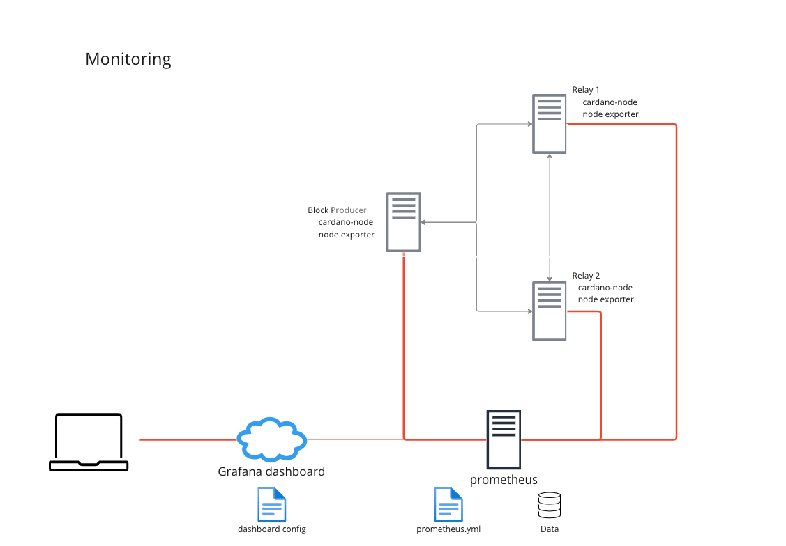

# Module 6 Monitoring our nodes

Cardano-node offers very important metrics about itself and the network. Makes them available for Prometheus and EKG. Let's set up a nice dashboard monitor our nodes.&#x20;

## Prometheus and node exporter

A reasonable monitoring setup looks like this, where we have a dedicated monitoring server which will scrape and collect data from all our nodes and make it available for a Grafana dashboard:

<figure><figcaption></figcaption></figure>

#### Configure cardano-node to export metrics:

\
First, let's configure our nodes to export metrics to prometheus.&#x20;

* Turn on log metrics setting it's value to "true"
* Set the listening port for `hasPrometheus`.  The default value is 127.0.0.1, let's change that to 0.0.0.0 so that it can accept connections from our monitoring server. You can use any port you want, I'll stick with the default 12798

```
{
...
  "TurnOnLogMetrics": true,
...
 "hasPrometheus": [
  "0.0.0.0",
  12798
  ],
...
}
```

#### Install Prometheus node exporter

Prometheus node\_exporter can be useful as well, so let's install node\_exporter:&#x20;

* [https://prometheus.io/docs/guides/node-exporter/#monitoring-linux-host-metrics-with-the-node-exporter](https://prometheus.io/docs/guides/node-exporter/#monitoring-linux-host-metrics-with-the-node-exporter)

```
wget https://github.com/prometheus/node_exporter/releases/download/v1.5.0/node_exporter-1.5.0.linux-amd64.tar.gz
tar xfvz node_exporter-1.5.0.linux-amd64.tar.gz
```

* Copy `node_exporter` executable to /usr/local/bin/

```bash
sudo cp node_exporter-1.5.0.linux-amd64/node_exporter /usr/local/bin/
```

Configure node exporter as a systemd unit

```
sudo nano /etc/systemd/system/node_exporter.service
```

```yaml
[Unit]
Description=Node Exporter
After=network.target

[Service]
User=clr
Type=simple
ExecStart=/usr/local/bin/node_exporter

[Install]
WantedBy=multi-user.target
```

* start node exporter

```
sudo systemctl daemon-reload
sudo systemctl start node_exporter
```

* Update firewall rules to allow connections to port 12798 (to access our cardano-node metrics) and 9100 (the default port for node-exporter)

#### Install prometheus on our monitoring server

* [https://prometheus.io/download/](https://prometheus.io/download/)
* Configure prometheus

```
# my global config
global:
  scrape_interval: 15s # Set the scrape interval to every 15 seconds. Default is every 1 minute.
  evaluation_interval: 15s # Evaluate rules every 15 seconds. The default is every 1 minute.
  # scrape_timeout is set to the global default (10s).

# Alertmanager configuration
alerting:
  alertmanagers:
    - static_configs:
        - targets:
          # - alertmanager:9093

# Load rules once and periodically evaluate them according to the global 'evaluation_interval'.
rule_files:
  # - "first_rules.yml"
  # - "second_rules.yml"

# A scrape configuration containing exactly one endpoint to scrape:
# Here it's Prometheus itself.
scrape_configs:
   - job_name: 'CARDANO-NODE' # To scrape data from the cardano node
     scrape_interval: 1s
     static_configs:
       - targets: ['x.x.x.x:12798']
       - targets: ['y.y.y.y:12798']
       - targets: ['z.z.z.z:12798']
   - job_name: 'EXPORTER' # To scrape data from a node exporter to monitor your linux host metrics.
     scrape_interval: 1s
     static_configs:
       - targets: ['x.x.x.x:9100']
       - targets: ['y.y.y.y:9100']
       - targets: ['z.z.z.z:9100']
```

* Run Prometheus

```
./prometheus --config.file=prometheus.yml
```

## Set up a Grafana dashboard

We have 2 options:

*   Install and run grafana locally (i.e. in our monitoring server)&#x20;

    [https://grafana.com/get/?plcmt=top-nav\&cta=downloads\&tab=self-managed](https://grafana.com/get/?plcmt=top-nav\&cta=downloads\&tab=self-managed)
* Use the cloud version [https://grafana.com/get/?plcmt=top-nav\&cta=downloads](https://grafana.com/get/?plcmt=top-nav\&cta=downloads)

In either case:&#x20;

* Configure grafana [https://prometheus.io/docs/visualization/grafana/](https://prometheus.io/docs/visualization/grafana/)

