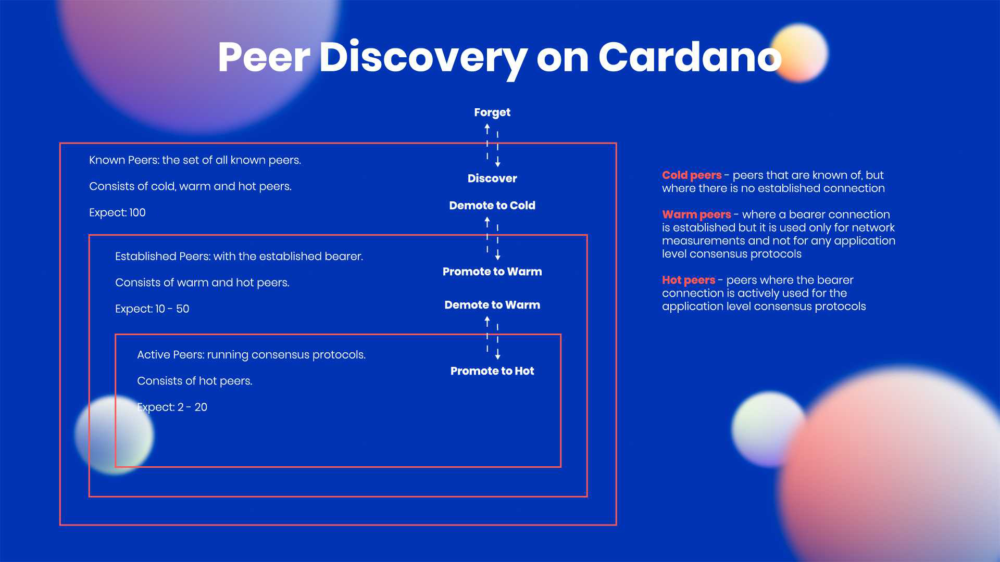

# Peer-to-peer (P2P) networking

### What do we achieve with P2P

* With automatic P2P, (registered) nodes can discover and establish connections with each other&#x20;
* Nodes can establish full duplex  connections (simultaneous server and client side)
* Nodes can maintain some static topology i.e. its own relays and bp, and trusted peers with which we always want to keep a connection
*   The node dynamically manages the connections:  Each node maintains a set of peers mapped into three categories:

    * **cold peers** ‒ existing (known) peers without an established network connection
    * **warm peers** ‒ peers with an established bearer connection, which is only used for network measurements without implementing any of the node-to-node mini-protocols.
    * **hot peers** ‒ peers that have a connection, which is being used by all three node-to-node mini-protocols

    Newly discovered peers are initially added to the cold peer set. The P2P governor is then responsible for peer connection management.
* Maintaining diversity in hop distances contributes to better block distribution times across the globally distributed network.
* In the case of adversarial behavior, the peer can be immediately demoted from the hot, warm, or cold sets.

<figure><figcaption></figcaption></figure>

### What is next

* Peer sharing&#x20;
* Release Ouroboros Genesis


Learn more:&#x20;

[Peer-to-peer (P2P) networking](https://docs.cardano.org/explore-cardano/cardano-network/p2p-networking)

[https://youtu.be/wnv7VCa79eo](https://youtu.be/wnv7VCa79eo)


### Configuring the node to use P2P

To Enable P2P, we do it from the configuration file, take for example the Preview testnet [configuration file](https://book.world.dev.cardano.org/environments/preview/config.json), it contains the field  `"EnableP2P".` It can be set to `false` or `true`

For example, on Preview testnet the default is `true` since this network is already running with P2P.&#x20;

<pre><code>{
...
<strong>  "EnableP2P": true,
</strong>...
  "TargetNumberOfActivePeers": 20,
  "TargetNumberOfEstablishedPeers": 40,
  "TargetNumberOfKnownPeers": 100,
  "TargetNumberOfRootPeers": 100,
  "TestEnableDevelopmentNetworkProtocols": true,
}
</code></pre>

#### The P2P topology file&#x20;



#### New P2P topology file format (please use it on node 1.35.6 Single Relay)


